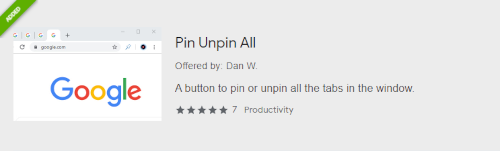

# Pin Unpin All

A Chrome browser extension that adds a button to pin or unpin all the tabs in the window.

------

## Description

Click the icon to toggle pin/unpin all tabs in active window based on the state of the active tab.

Icon works with dark and light themes.

Update (v2.0): Updated to Manifest V3 for Chrome Extensions

## Support

View details in the [chrome web store](https://chrome.google.com/webstore/detail/pin-unpin-all/cpncfbofpjgdfpmdacbagkaoglmkhnne).

Get developer support at [support.danericweiner.com](https://support.danericweiner.com/).

